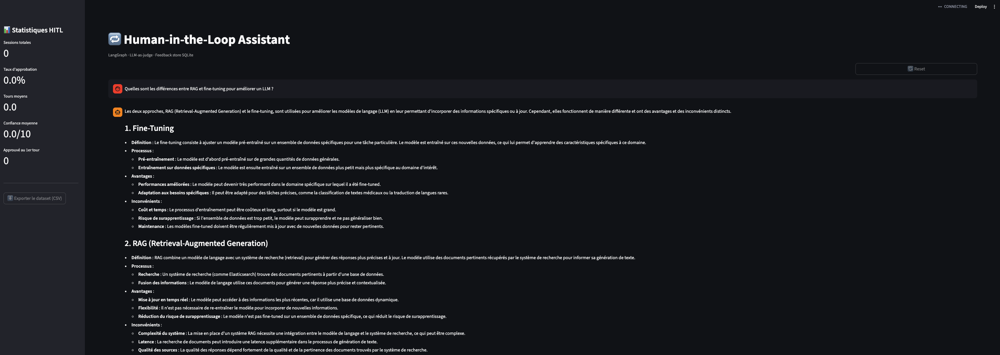
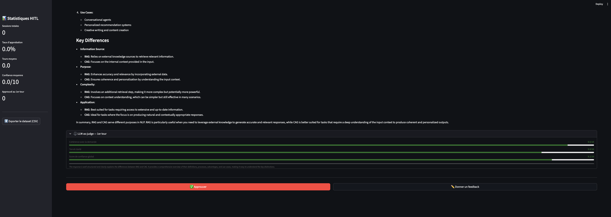

# LangGraph HITL — Production-Grade GenAI Pipeline

> **Fork & extension** of [esurovtsev/langgraph-hitl-fastapi-demo](https://github.com/esurovtsev/langgraph-hitl-fastapi-demo)  
> Extended with an LLM-as-judge evaluation layer, persistent feedback store, HuggingFace Inference API support, and a Streamlit interface — turning a minimal demo into a traceable, evaluable GenAI feedback loop.


---

## Screenshots

| HITL Chat + LLM-as-judge scorecard | Statistics dashboard & CSV export |
|---|---|
|  |  |

---

## Overview

**Human-in-the-Loop (HITL)** is a critical pattern in production GenAI systems — it allows a human to review, correct, and approve AI-generated content before it reaches end users.

This project extends the original HITL demo by addressing what production systems actually require:

- Automated quality evaluation at every generation step, via LLM-as-judge
- Persistent storage of feedback interactions to progressively build fine-tuning datasets
- Multi-turn revision tracking with per-turn score history
- Provider-agnostic LLM integration — no OpenAI dependency

---

## Extensions vs. the Original

The original project by [@esurovtsev](https://github.com/esurovtsev) is a clean minimal HITL implementation with FastAPI and React. The following components were designed and implemented on top of it.

### LLM-as-judge Evaluation Layer — `evaluator.py`

A dedicated evaluation node integrated directly into the LangGraph graph. After every draft generation, the judge model scores the output on four criteria:

| Criterion | Description |
|---|---|
| Coherence | Does the response address the user's request precisely? |
| Tone & Clarity | Is the response well-structured and appropriately toned? |
| Feedback Respect | Was the human's feedback correctly incorporated? (revision turns only) |
| Global Confidence | Is this draft ready for the end user? |

Each score is `0–10` with a textual rationale. Output is structured via a Pydantic `BaseModel` for reliable JSON parsing, with a regex fallback for robustness under model variability.

### Persistent Feedback Store — `feedback_store.py`

A SQLite-based persistence layer that records every HITL interaction, designed for downstream fine-tuning dataset generation.

Schema:
```
sessions        — one row per conversation (thread_id, outcome, avg_confidence)
feedback_turns  — one row per draft/feedback/eval cycle
```

Key methods:
- `get_session_stats()` — approval rates, average turns to approval, average confidence score
- `get_dataset_for_finetuning()` — exports structured `(prompt, draft, human_feedback, action, scores)` records
- WAL journal mode enabled for safe concurrent access

### Extended LangGraph Graph — `graph.py`

Two new nodes inserted into the original graph flow:

```
START
  |
  v
assistant_draft
  |
  v
evaluator          <-- new: scores the draft (4 criteria)
  |
  v
human_feedback     <-- pause: waits for human decision
  |
  v
feedback_logger    <-- new: persists turn + scores to SQLite
  |
  +-- (feedback) --> assistant_draft
  |
  +-- (approved) --> assistant_finalize --> END
```

New state fields: `eval_scores`, `eval_rationale`, `revision_count`, `thread_id`.

### HuggingFace Inference API — `graph.py` / `evaluator.py`

Replaced the OpenAI dependency with `Qwen/Qwen2.5-72B-Instruct` via the HuggingFace Inference API. Both the draft model and the judge model run on HuggingFace, making the entire pipeline free-tier compatible with no credit card required.

### Streamlit Interface — `streamlit_app.py`

Replaced the React/FastAPI stack with a self-contained Streamlit application that imports LangGraph directly (no intermediate API layer):

- Score bars per criterion with semantic color coding (green / orange / red)
- Multi-turn chat history with role-based display
- Real-time statistics sidebar
- One-click CSV export of the full feedback dataset

---

## Architecture

```
+--------------------------------------------------+
|                  Streamlit App                   |
|  +------------+  +------------+  +------------+  |
|  | HITL Chat  |  | Scorecard  |  | Stats/CSV  |  |
|  +------------+  +------------+  +------------+  |
+---------------------+----------------------------+
                      | direct Python import
+---------------------v----------------------------+
|               LangGraph Graph                    |
|                                                  |
|  assistant_draft --> evaluator --> human_feedback|
|        ^                               |         |
|        +------- feedback_logger <------+         |
|                        |                         |
|                        +--> assistant_finalize   |
+----------+--------------------+-----------------+
           |                    |
  +--------v-------+   +--------v-------+
  | HuggingFace    |   | SQLite         |
  | Qwen2.5-72B    |   | hitl_feedback  |
  +----------------+   +----------------+
```

---

## Quick Start

### Prerequisites

- Python 3.11+
- [pyenv](https://github.com/pyenv/pyenv) (recommended)
- A free [HuggingFace account](https://huggingface.co/settings/tokens) with a Read token

### Setup

```bash
# Clone
git clone https://github.com/<your-username>/langgraph-hitl-genai-pipeline.git
cd langgraph-hitl-genai-pipeline

# Create environment
pyenv virtualenv 3.11.10 env_hitl
cd backend
pyenv local env_hitl

# Install dependencies
pip install -r requirements.txt

# Set HuggingFace token
export HF_TOKEN=hf_xxxxxxxxxxxxxxxxxxxx

# Launch
streamlit run streamlit_app.py
```

Open [http://localhost:8501](http://localhost:8501).

---

## Project Structure

```
langgraph-hitl-genai-pipeline/
|
+-- backend/
|   +-- app/
|   |   +-- graph.py               # Extended: +evaluator +feedback_logger nodes
|   |   +-- evaluator.py           # New: LLM-as-judge, 4 criteria, Pydantic output
|   |   +-- feedback_store.py      # New: SQLite persistence + dataset export
|   |   +-- models.py              # Extended: EvalScoresResponse, StatsResponse
|   |   +-- lesson_01_blocking.py  # Extended: eval scores, /stats, /dataset endpoints
|   |   +-- lesson_02_streaming.py # Extended: SSE 'eval' event
|   |   +-- lesson_03_async_mcp.py # Original: async MCP tool approval
|   |   +-- mcp_agent.py           # Original: ReAct agent with HITL tool wrapping
|   |   +-- main.py                # Original: FastAPI entry point
|   +-- streamlit_app.py           # New: Streamlit UI, no FastAPI required
|   +-- requirements.txt
|   +-- hitl_feedback.db           # Auto-generated on first run
|
+-- screenshots/
+-- README.md
```

---

## GenAI Engineering Concepts

| Concept | Implementation |
|---|---|
| HITL workflow | LangGraph `interrupt_before` + `update_state` + resume pattern |
| LLM-as-judge | Dedicated evaluator node with structured Pydantic output |
| Agentic state machine | Typed `DraftReviewState` with explicit transitions |
| Fine-tuning data collection | SQLite store with CSV export of labeled interactions |
| Multi-turn revision tracking | `revision_count` in graph state, per-turn score history |
| Provider-agnostic LLM | LangChain abstraction — one-line swap between providers |
| Structured output parsing | Pydantic `BaseModel` + regex fallback |
| Conversation checkpointing | LangGraph `MemorySaver` for in-session state persistence |

---

## Feedback Dataset Schema

Every interaction is persisted and exportable as CSV:

```python
{
    "human_request":    str,    # original user prompt
    "draft":            str,    # LLM-generated draft
    "human_comment":    str,    # human feedback (if any)
    "human_action":     str,    # "approved" | "feedback"
    "score_coherence":  float,  # 0-10
    "score_tone":       float,  # 0-10
    "score_feedback":   float,  # 0-10 | None
    "score_confidence": float,  # 0-10
    "eval_rationale":   str,    # judge rationale
    "turn_number":      int     # revision index
}
```

This schema is directly compatible with RLHF, DPO, and supervised fine-tuning pipelines.

---

## Configuration

| Variable | Description | Default |
|---|---|---|
| `HF_TOKEN` | HuggingFace API token | required |
| `HITL_DB_PATH` | SQLite database path | `backend/hitl_feedback.db` |
| `repo_id` in `graph.py` | HuggingFace model | `Qwen/Qwen2.5-72B-Instruct` |

To switch to OpenAI, replace the model instantiation in `graph.py` and `evaluator.py`:

```python
from langchain_openai import ChatOpenAI
model = ChatOpenAI(model="gpt-4o-mini")
```

---

## Credits

Base project: [esurovtsev/langgraph-hitl-fastapi-demo](https://github.com/esurovtsev/langgraph-hitl-fastapi-demo)  
Extended by: [@azbenammar](https://github.com/azbenammar)

---

## License

MIT
